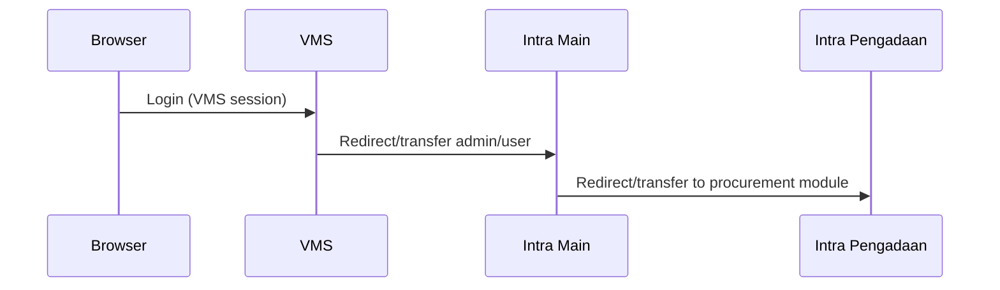

# eProc (VMS + Intra)

This repository contains a Dockerized local development setup for an eProc ecosystem that consists of three CodeIgniter applications, plus a Phase 6 Wave B dev-only pilot placeholder app for coexistence proof:

- **VMS** (Vendor Management System) served from `vms/app`
- **Intra Main** (internal portal) served from `intra/main`
- **Intra Pengadaan** (procurement module) served from `intra/pengadaan`
- **Pilot App Placeholder** (`pilot-app/public/index.php`) for shadow-route and scoped toggle readiness checks (`/_pilot/auction/*`, selected `/auction/*`, dev only)

The stack is primarily **PHP (CodeIgniter 3)** + **Nginx** + **MariaDB** + **Redis** (sessions).

## Architecture (Local)

```mermaid
flowchart LR
  U[Browser]
  N[Nginx :8080]
  V[VMS PHP-FPM\n/var/www/html/vms]
  I[Intra PHP-FPM\n/var/www/html/intra]
  P[Pilot Placeholder PHP-FPM\n/var/www/html/pilot-app]
  D[(MariaDB 10.5)]
  R[(Redis 7)]

  U -->|Host: vms.localhost| N
  U -->|Host: intra.localhost| N
  N -->|/ -> /var/www/html/vms/app| V
  N -->|/_pilot/auction/* (dev shadow)| P
  N -->|/auction/admin/json_provider/get_barang/* (toggle ON)| P
  N -->|/auction/admin/json_provider/get_peserta/* (toggle ON)| P
  N -->|/main -> /var/www/html/intra/main| I
  N -->|/pengadaan -> /var/www/html/intra/pengadaan| I
  V --> D
  I --> D
  V --> R
  I --> R
```

## URLs (Docker Compose)

Assuming `docker compose up` and your hosts/DNS resolves the following hostnames:

- **Intra**
  - `http://intra.localhost:8080/main/`
  - `http://intra.localhost:8080/pengadaan/`
- **VMS**
  - `http://vms.localhost:8080/`
  - `http://vms.localhost:8080/_pilot/auction/health` (Phase 6 Wave B shadow-route health, dev only)
  - `http://vms.localhost:8080/auction/admin/json_provider/get_barang/1` (scoped toggle target, dev validation)
  - `http://vms.localhost:8080/auction/admin/json_provider/get_peserta/1` (scoped toggle target, dev validation)

Nginx routing for these hosts lives in `docker/nginx/default.conf`.

## Repo Layout

- `docker-compose.yml` – brings up Nginx + 3 PHP-FPM containers (`vms`, `intra`, `pilot-app` placeholder) + MariaDB + Redis
- `docker-compose.php82.yml` – runtime override untuk mem-build `vms-app` dan `intra-app` ke PHP 8.2 (pilot placeholder tetap image lokal dev proof)
- `docker/`
  - `nginx/default.conf` – vhost routing for `vms.localhost` and `intra.localhost`
  - `php/Dockerfile` – PHP-FPM 7.4 image used by both apps (legacy-compatible, includes `mcrypt` + `redis`)
  - `php/Dockerfile.php82` – optional PHP-FPM 8.2 image for upgrade work
  - `init-db/` – initial SQL loaded into MariaDB on first boot
- `pilot-app/`
  - `public/index.php` – placeholder endpoint untuk `/_pilot/auction/health` + stub Stage 2 route toggle subset (`get_barang`, `get_peserta`) (bukan implementasi bisnis/Laravel final)
- `intra/`
  - `main/` – CodeIgniter app for internal “main” portal
  - `pengadaan/` – CodeIgniter app for procurement module
  - `.env.example` – example env (do not commit real `.env`)
- `vms/`
  - `app/` – CodeIgniter app for VMS
  - `.env.example` – example env (do not commit real `.env`)

## Quick Start (Docker)

Prerequisites:
- Docker Desktop (with Compose)
- Git
- Local DNS/hosts mapping for `intra.localhost` and `vms.localhost` to `127.0.0.1`

### 1) Add local hostnames

Both apps are routed by Nginx based on the `Host` header. Add these entries:

```
127.0.0.1  intra.localhost
127.0.0.1  vms.localhost
```

Windows hosts file:
- `C:\Windows\System32\drivers\etc\hosts`

### 2) Create `.env` files (do not commit)

At repo root:
- Copy `.env.example` -> `.env`
- Adjust values that need to differ from local defaults

There are example env files in both app trees.

- Intra:
  - Copy `intra/.env.example` → `intra/.env`
  - Ensure these match your local URLs:
    - `MAIN_BASE_URL=http://intra.localhost:8080/main/`
    - `MAIN_PENGADAAN_URL=http://intra.localhost:8080/pengadaan/`
    - `MAIN_VMS_URL=http://vms.localhost:8080/`
- VMS:
  - Copy `vms/.env.example` → `vms/.env` (and/or `vms/app/.env` if your setup uses that location)
  - Ensure:
    - `BASE_URL=http://vms.localhost:8080/`
    - `EXTERNAL_URL=http://intra.localhost:8080/main/`

Important:
- VMS is served at `http://vms.localhost:8080/` (no `/app` prefix). If you set `BASE_URL` to include `/app/`, routing will break.
- Phase 6 dev coexistence hook:
  - `EPROC_PILOT_APP_BIND_PATH` (root `.env`) mengatur source bind mount untuk service `pilot-app`
  - Default: `./pilot-app` (placeholder di repo ini)
  - Untuk repo Laravel final sibling nanti bisa diarahkan ke `../nama-repo-laravel-final` atau path absolut Windows

### 3) Start the stack

From repo root:

```bash
docker compose up -d --build
```

Dual-runtime helper (recommended):
```powershell
pwsh ./tools/dev-env.ps1 -Action start -PhpRuntime 7.4
pwsh ./tools/dev-env.ps1 -Action smoke -PhpRuntime 7.4
pwsh ./tools/dev-env.ps1 -Action coexistence -PhpRuntime 7.4
pwsh ./tools/dev-env.ps1 -Action coexistence-stage2 -PhpRuntime 7.4 -AuctionLelangId 1
pwsh ./tools/dev-env.ps1 -Action deps -PhpRuntime 7.4
pwsh ./tools/dev-env.ps1 -Action cron -PhpRuntime 7.4
```

PHP 8.2 validation:
```powershell
pwsh ./tools/dev-env.ps1 -Action start -PhpRuntime 8.2
pwsh ./tools/dev-env.ps1 -Action smoke -PhpRuntime 8.2
pwsh ./tools/dev-env.ps1 -Action deps -PhpRuntime 8.2
pwsh ./tools/dev-env.ps1 -Action cron -PhpRuntime 8.2
```

This brings up:
- `eproc-webserver` (Nginx, port `8080`)
- `eproc-vms-app` (PHP-FPM)
- `eproc-intra-app` (PHP-FPM)
- `eproc-pilot-app` (PHP-FPM placeholder for Phase 6 shadow route readiness)
- `eproc-db` (MariaDB, host port `3308`)
- `eproc-redis` (Redis, internal-only)

### 4) First-time database

On first boot, MariaDB runs initialization scripts from:
- `docker/init-db/` (mounted into `/docker-entrypoint-initdb.d`)

Default DB config in `docker-compose.yml`:
- Host (from apps): `db:3306` (Docker network)
- Host (from your machine): `localhost:3308`
- User: `eproc_app` (from `.env`)
- Password: `EPROC_MYSQL_PASSWORD` (from `.env`)
- Database: `eproc`

If you need a clean reset (destructive):

```bash
docker compose down -v
docker compose up -d --build
```

### 5) (Optional) Install PHP dependencies

Each app contains a `composer.json`. If you do not have `vendor/` directories yet, run Composer inside the containers:

```bash
docker compose exec intra-app bash -lc "cd /var/www/html/intra/main && composer install"
docker compose exec intra-app bash -lc "cd /var/www/html/intra/pengadaan && composer install"
docker compose exec vms-app bash -lc "cd /var/www/html/vms/app && composer install"
```

### 6) Open the apps

- Intra Main: `http://intra.localhost:8080/main/`
- Intra Pengadaan: `http://intra.localhost:8080/pengadaan/`
- VMS: `http://vms.localhost:8080/`
- Pilot shadow health (dev only): `http://vms.localhost:8080/_pilot/auction/health`

Stop:

```bash
docker compose down
```

### 7) Where routing is defined

Nginx vhost routing lives in `docker/nginx/default.conf`:
- `server_name vms.localhost` → `root /var/www/html/vms/app`
- `server_name intra.localhost` → routes `/main` and `/pengadaan` to their respective `index.php`

## Environment Variables

Both apps use environment variables loaded from `.env` files (examples are provided).

Typical local values (example):

- Intra `.env`
  - `MAIN_BASE_URL=http://intra.localhost:8080/main/`
  - `MAIN_PENGADAAN_URL=http://intra.localhost:8080/pengadaan/`
  - `MAIN_VMS_URL=http://vms.localhost:8080/`
- VMS `.env`
  - `BASE_URL=http://vms.localhost:8080/`
  - `EXTERNAL_URL=http://intra.localhost:8080/main/`

Do **not** commit real `.env` files; use `.env.example` as the template.

## Dev Runbook

Use the phase-1 runbook for daily operations and troubleshooting:
- `docs/DEV_ENV_RUNBOOK.md`

Shortcut helper command:
```powershell
pwsh ./tools/dev-env.ps1 -Action start -PhpRuntime 7.4
pwsh ./tools/dev-env.ps1 -Action smoke -PhpRuntime 7.4
pwsh ./tools/dev-env.ps1 -Action coexistence -PhpRuntime 7.4
pwsh ./tools/dev-env.ps1 -Action deps -PhpRuntime 7.4
pwsh ./tools/dev-env.ps1 -Action cron -PhpRuntime 7.4
pwsh ./tools/dev-env.ps1 -Action stop -PhpRuntime 7.4
```

## Phase 6 Wave B (Pilot Readiness) Notes

- `pilot-app` saat ini adalah **placeholder dev-only** untuk membuktikan wiring coexistence (`docker-compose` + Nginx shadow route + smoke), bukan aplikasi Laravel final.
- Stage 2 scoped route toggle sudah tersedia untuk endpoint:
  - `/auction/admin/json_provider/get_barang/*`
  - `/auction/admin/json_provider/get_peserta/*`
- Rollback switch cepat tetap via Nginx include + reload (tanpa full stack restart) menggunakan helper:
  - `pwsh ./tools/dev-env.ps1 -Action toggle-auction-subset -ToggleMode status|on|off -PhpRuntime 7.4`
- Validasi Stage 2 routing/marker:
  - `pwsh ./tools/dev-env.ps1 -Action coexistence-stage2 -PhpRuntime 7.4 -AuctionLelangId 1`
- Integrasi skeleton Laravel final (repo terpisah) disiapkan via sibling bind mount:
  - set `.env` root: `EPROC_PILOT_APP_BIND_PATH=../nama-repo-laravel-final`
  - lalu restart env (`pilot-app` recreate) dan ulangi smoke `coexistence` + `coexistence-stage2`
- Shadow route yang aktif untuk proof:
  - `/_pilot/auction/*` pada host `vms.localhost`
- Smoke coexistence lokal:
  - `pwsh ./tools/dev-env.ps1 -Action coexistence -PhpRuntime 7.4`
- Referensi runbook operasional Stage 2 + sibling bind-mount:
  - `docs/DEV_ENV_RUNBOOK.md`
- Referensi status/evidence:
  - `docs/PHASE6_COEXISTENCE_DEV_BASELINE.md`
  - `docs/PHASE6_GO_NO_GO.md`

## Cross-App Flows

### Login/Transfer (high-level)



### Logout (high-level)

Cross-app logout should clear session in the current app and also clear the corresponding remote session to prevent “auto-login loops”.

## Troubleshooting

- **404 on VMS URLs**
  - VMS is served from host `vms.localhost` with `root /var/www/html/vms/app` (no `/app` prefix in the URL).
- **CodeIgniter warnings/notices**
  - Enable/inspect error logging docs under `intra/docs/` and `vms/docs/`.
- **DB not initialized**
  - First boot runs SQL from `docker/init-db/` into MariaDB.

## Security Notes

- Never commit secrets: `.env`, real DB passwords, private keys, or production configs.
- Prefer `.env.example` and documentation over committed secrets.

## Additional Docs

- `docs/` – security and PHP upgrade notes for the Dockerized stack
- `docs/DEV_ENV_RUNBOOK.md` – start/stop/reset/smoke/troubleshooting for local dev env
- `intra/docs/` – environment setup notes and operational guides for Intra
- `vms/docs/` – VMS-specific guides (auth, production readiness, testing)
