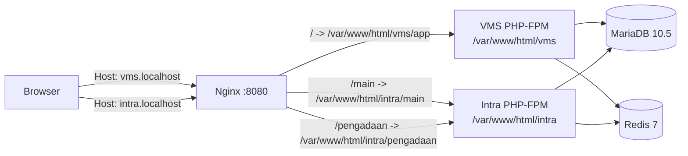
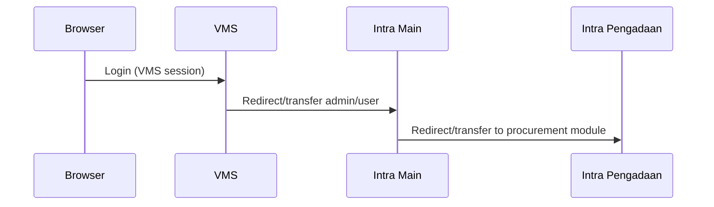

# eProc (VMS + Intra)

This repository contains a Dockerized local development setup for an eProc ecosystem that consists of three CodeIgniter applications:

- **VMS** (Vendor Management System) served from `vms/app`
- **Intra Main** (internal portal) served from `intra/main`
- **Intra Pengadaan** (procurement module) served from `intra/pengadaan`

The stack is primarily **PHP (CodeIgniter 3)** + **Nginx** + **MariaDB** + **Redis** (sessions).

## Architecture (Local)



## URLs (Docker Compose)

Assuming `docker-compose up` and your hosts/DNS resolves the following hostnames:

- **Intra**
  - `http://intra.localhost:8080/main/`
  - `http://intra.localhost:8080/pengadaan/`
- **VMS**
  - `http://vms.localhost:8080/`

Nginx routing for these hosts lives in [default.conf](file:///c:/inetpub/eproc/docker/nginx/default.conf).

## Repo Layout

- `docker-compose.yml` – brings up Nginx + 2 PHP-FPM containers + MariaDB + Redis
- `docker/`
  - `nginx/default.conf` – vhost routing for `vms.localhost` and `intra.localhost`
  - `php/Dockerfile` – PHP-FPM 7.4 image used by both apps (legacy-compatible, includes `mcrypt` + `redis`)
  - `php/Dockerfile.php82` – optional PHP-FPM 8.2 image for upgrade work
  - `init-db/` – initial SQL loaded into MariaDB on first boot
- `intra/`
  - `main/` – CodeIgniter app for internal “main” portal
  - `pengadaan/` – CodeIgniter app for procurement module
  - `.env.example` – example env (do not commit real `.env`)
- `vms/`
  - `app/` – CodeIgniter app for VMS
  - `.env.example` – example env (do not commit real `.env`)

## Quick Start (Docker)

Prerequisites:
- Docker Desktop (with Compose)
- Git
- Local DNS/hosts mapping for `intra.localhost` and `vms.localhost` to `127.0.0.1`

### 1) Add local hostnames

Both apps are routed by Nginx based on the `Host` header. Add these entries:

```
127.0.0.1  intra.localhost
127.0.0.1  vms.localhost
```

Windows hosts file:
- `C:\Windows\System32\drivers\etc\hosts`

### 2) Create `.env` files (do not commit)

At repo root:
- Copy `.env.example` → `.env`
- Set strong values for `MYSQL_ROOT_PASSWORD` and `MYSQL_PASSWORD`

There are example env files in both app trees.

- Intra:
  - Copy `intra/.env.example` → `intra/.env`
  - Ensure these match your local URLs:
    - `MAIN_BASE_URL=http://intra.localhost:8080/main/`
    - `MAIN_PENGADAAN_URL=http://intra.localhost:8080/pengadaan/`
    - `MAIN_VMS_URL=http://vms.localhost:8080/`
- VMS:
  - Copy `vms/.env.example` → `vms/.env` (and/or `vms/app/.env` if your setup uses that location)
  - Ensure:
    - `BASE_URL=http://vms.localhost:8080/`
    - `EXTERNAL_URL=http://intra.localhost:8080/main/`

Important:
- VMS is served at `http://vms.localhost:8080/` (no `/app` prefix). If you set `BASE_URL` to include `/app/`, routing will break.

### 3) Start the stack

From repo root:

```bash
docker-compose up -d --build
```

This brings up:
- `eproc-webserver` (Nginx, port `8080`)
- `eproc-vms-app` (PHP-FPM)
- `eproc-intra-app` (PHP-FPM)
- `eproc-db` (MariaDB, host port `3308`)
- `eproc-redis` (Redis, internal-only)

### 4) First-time database

On first boot, MariaDB runs initialization scripts from:
- `docker/init-db/` (mounted into `/docker-entrypoint-initdb.d`)

Default DB config in [docker-compose.yml](file:///c:/inetpub/eproc/docker-compose.yml#L47-L66):
- Host (from apps): `db:3306` (Docker network)
- Host (from your machine): `localhost:3308`
- User: `eproc_app` (from `.env`)
- Password: `MYSQL_PASSWORD` (from `.env`)
- Database: `eproc`

If you need a clean reset (destructive):

```bash
docker-compose down -v
docker-compose up -d --build
```

### 5) (Optional) Install PHP dependencies

Each app contains a `composer.json`. If you do not have `vendor/` directories yet, run Composer inside the containers:

```bash
docker-compose exec intra-app bash -lc "cd /var/www/html/intra/main && composer install"
docker-compose exec intra-app bash -lc "cd /var/www/html/intra/pengadaan && composer install"
docker-compose exec vms-app bash -lc "cd /var/www/html/vms/app && composer install"
```

### 6) Open the apps

- Intra Main: `http://intra.localhost:8080/main/`
- Intra Pengadaan: `http://intra.localhost:8080/pengadaan/`
- VMS: `http://vms.localhost:8080/`

Stop:

```bash
docker-compose down
```

### 7) Where routing is defined

Nginx vhost routing lives in [default.conf](file:///c:/inetpub/eproc/docker/nginx/default.conf):
- `server_name vms.localhost` → `root /var/www/html/vms/app`
- `server_name intra.localhost` → routes `/main` and `/pengadaan` to their respective `index.php`

## Environment Variables

Both apps use environment variables loaded from `.env` files (examples are provided).

Typical local values (example):

- Intra `.env`
  - `MAIN_BASE_URL=http://intra.localhost:8080/main/`
  - `MAIN_PENGADAAN_URL=http://intra.localhost:8080/pengadaan/`
  - `MAIN_VMS_URL=http://vms.localhost:8080/`
- VMS `.env`
  - `BASE_URL=http://vms.localhost:8080/`
  - `EXTERNAL_URL=http://intra.localhost:8080/main/`

Do **not** commit real `.env` files; use `.env.example` as the template.

## Cross-App Flows

### Login/Transfer (high-level)



### Logout (high-level)

Cross-app logout should clear session in the current app and also clear the corresponding remote session to prevent “auto-login loops”.

## Troubleshooting

- **404 on VMS URLs**
  - VMS is served from host `vms.localhost` with `root /var/www/html/vms/app` (no `/app` prefix in the URL).
- **CodeIgniter warnings/notices**
  - Enable/inspect error logging docs under `intra/docs/` and `vms/docs/`.
- **DB not initialized**
  - First boot runs SQL from `docker/init-db/` into MariaDB.

## Security Notes

- Never commit secrets: `.env`, real DB passwords, private keys, or production configs.
- Prefer `.env.example` and documentation over committed secrets.

## Additional Docs

- `docs/` – security and PHP upgrade notes for the Dockerized stack
- `intra/docs/` – environment setup notes and operational guides for Intra
- `vms/docs/` – VMS-specific guides (auth, production readiness, testing)
