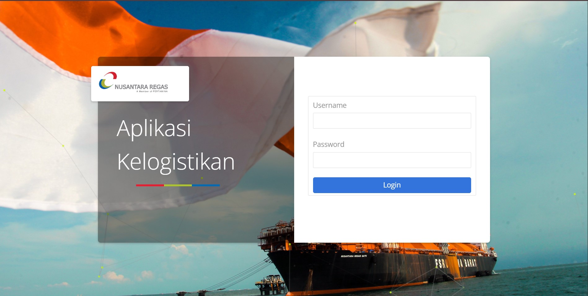
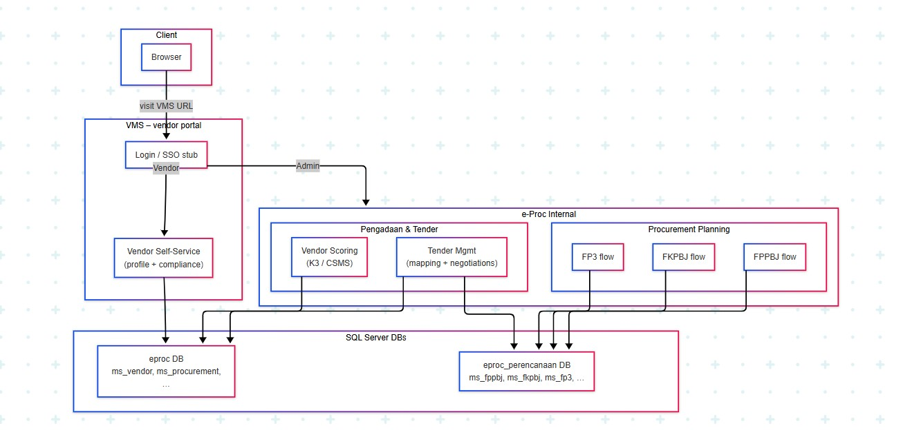

# Vendor Management System (VMS)

A comprehensive Vendor Management System built on CodeIgniter 3 framework, designed to streamline vendor registration, qualification, and management processes. This system helps organizations efficiently manage their vendor relationships, ensure compliance, and maintain a qualified vendor database.

## System Overview


*Login Page of the VMS System*


*Complete E-Procurement System Flow*

## E-Procurement Ecosystem

This VMS is part of a larger E-Procurement ecosystem that consists of three interconnected systems:

1. **Vendor Management System (VMS)** - Current Project
   - Handles vendor registration and qualification
   - Manages vendor documents and compliance
   - Processes vendor assessments and evaluations

2. **Internal E-Procurement System** ([eproc-internal](https://github.com/revanza-git/eproc-internal))
   - Manages internal procurement processes
   - Handles purchase requests and orders
   - Controls budget and approvals
   - Requires admin access

3. **VMS Admin System** ([eproc-vms-admin](https://github.com/revanza-git/eproc-vms-admin))
   - Provides administrative controls
   - Manages system configurations
   - Handles user management
   - Requires admin access

### System Integration
- All three systems are designed to work together seamlessly
- Shared authentication and authorization
- Synchronized data across systems
- Unified reporting and analytics

### Detailed System Flow

#### 1. Vendor Management System (VMS) Flow
- **Vendor Registration**
  - Initial registration with basic company information
  - Document submission (legal documents, certifications)
  - Automated document validation
  - Initial screening and verification

- **Vendor Qualification**
  - Document verification process
  - Compliance checks
  - Risk assessment
  - Performance evaluation
  - Qualification status determination

- **Vendor Assessment**
  - K3 (Health & Safety) evaluation
  - CSMS (Contractor Safety Management System) assessment
  - Technical capability assessment
  - Financial stability check
  - Performance history review

#### 2. Internal E-Procurement Flow
- **Purchase Request (PR) Process**
  - PR creation and submission
  - Budget verification
  - Technical specification review
  - Multi-level approval workflow
  - Vendor selection from qualified pool

- **Purchase Order (PO) Management**
  - PO generation
  - Contract creation
  - Terms and conditions verification
  - Approval routing
  - Document finalization

- **Contract Management**
  - Contract execution
  - Performance monitoring
  - Payment processing
  - Contract renewal/termination
  - Compliance tracking

#### 3. VMS Admin System Flow
- **User Management**
  - User registration and role assignment
  - Access control configuration
  - Permission management
  - User activity monitoring
  - Security policy enforcement

- **System Configuration**
  - Workflow customization
  - Document template management
  - Email notification setup
  - System parameter configuration
  - Integration settings

- **Monitoring and Reporting**
  - System health monitoring
  - Performance metrics tracking
  - Audit log management
  - Report generation
  - Data analytics

#### Integration Points
- **Data Synchronization**
  - Real-time vendor data updates
  - Document status synchronization
  - User authentication sharing
  - Transaction data consistency
  - Cross-system reporting

- **Workflow Integration**
  - Seamless handoff between systems
  - Automated status updates
  - Unified notification system
  - Consistent user experience
  - Integrated approval chains

- **Security Integration**
  - Single sign-on (SSO) capability
  - Unified access control
  - Centralized audit logging
  - Cross-system security policies
  - Integrated backup systems

## Table of Contents
- [Core Features](#core-features)
- [Technical Requirements](#technical-requirements)
- [Installation](#installation)
- [Security Considerations](#security-considerations)
- [Support and Contact](#support-and-contact)
- [License](#license)
- [Contributing](#contributing)
- [Important Notes](#important-notes)

## Core Features

### Vendor Registration & Onboarding
- Multi-step vendor registration process with validation
- Document verification workflow with automated checks
- Automated email notifications for status updates
- Comprehensive vendor profile management
- Legal document management (NPWP, NPPKP, etc.)
- Company information verification
- Contact person management

### Vendor Qualification
- Comprehensive vendor assessment and evaluation
- Document verification system with version control
- Compliance tracking and monitoring
- Blacklist management and tracking
- Vendor categorization and classification
- Performance history tracking
- Qualification status management

### Document Management
- Legal document verification (Akta, SIUP, TDP, etc.)
- Document expiration tracking and alerts
- Automated renewal notifications
- Document version control and history
- Digital document storage with secure access
- Document approval workflow
- Document status tracking

### Vendor Assessment
- K3 (Health & Safety) assessment
- CSMS (Contractor Safety Management System) evaluation
- Performance tracking and scoring
- Risk assessment and monitoring
- Vendor scoring system
- Assessment history tracking
- Compliance monitoring

### Approval Workflow
- Multi-level approval system with role-based access
- Role-based access control (RBAC)
- Approval tracking and history
- Automated notifications for pending approvals
- Audit trail for all approval actions
- Approval delegation capabilities
- Status tracking and reporting

### Vendor Communication
- Automated email notifications for important updates
- System alerts for document expiration
- Document status updates
- Vendor portal access with secure login
- Communication history tracking
- Bulk notification capabilities
- Custom email templates

## Technical Requirements

### Server Requirements
- PHP >= 7.4.0
- MySQL/MariaDB >= 5.7
- Apache >= 2.4 or Nginx >= 1.18
- Composer for dependency management

### Required PHP Extensions
- mysqli
- json
- mbstring
- xml
- gd
- curl
- zip
- fileinfo

### Recommended Server Configuration
- 4GB RAM minimum
- 20GB storage space
- SSL certificate for HTTPS
- Regular backup system

## Installation

1. Clone the repository:
```bash
git clone [repository-url]
cd vms
```

2. Install dependencies:
```bash
composer install
```

3. Configure the database:
   - Create a new database
   - Import the database schema from `database/schema.sql`
   - Update database configuration in `application/config/database.php`
   - Set proper database credentials

4. Configure the application:
   - Set base URL in `application/config/config.php`
   - Configure email settings in `application/config/email.php`
   - Update company information in system settings
   - Set proper file permissions

5. Web server configuration:
   - Point document root to the project's public directory
   - Ensure proper permissions for upload directories
   - Configure URL rewriting
   - Enable required PHP extensions

6. Initial setup:
   - Create admin user through setup wizard
   - Configure initial system settings
   - Set up email templates
   - Configure document storage paths

## Security Considerations

- Change default credentials immediately after installation
- Enable HTTPS for all communications
- Implement regular security updates
- Set up proper access controls and permissions
- Regular backup of vendor data
- Secure document storage with encryption
- Implement audit logging
- Regular security audits
- Implement rate limiting
- Set up firewall rules

## Support and Contact

For technical support or inquiries, please contact:
- Email: revanza.raytama@gmail.com
- LinkedIn: [linkedin](https://linkedin.com/in/revanzaraytama)

## License

This project is licensed under the MIT License - see the [LICENSE](LICENSE) file for details.

## Contributing

Please read [CONTRIBUTING.md](CONTRIBUTING.md) for details on our code of conduct and the process for submitting pull requests.

## Important Notes

- The system is production-ready but requires proper configuration
- Built using HMVC architecture for better code organization
- Regular maintenance and updates are recommended
- Vendor data should be regularly backed up
- System performance should be monitored regularly
- Regular security audits are recommended
- Keep all dependencies updated
- Monitor system logs regularly

## Vendor Portal Features

- Self-service registration with validation
- Document upload and management
- Profile updates and maintenance
- Status tracking and notifications
- Communication center
- Document expiration notifications
- Assessment results viewing
- Performance metrics access
- Document version history
- Compliance status tracking

## Admin Features

- Vendor approval workflow management
- Document verification and validation
- Assessment management and scoring
- Blacklist management and tracking
- System configuration and settings
- User management and permissions
- Report generation and export
- Audit trail access and monitoring
- Bulk operations support
- System health monitoring 