# 🏛️ E-Procurement Intra System

[](https://php.net)
[](https://codeigniter.com)
[](https://mysql.com)
[](LICENSE)
[](#)

A comprehensive web-based **Electronic Procurement System** built with CodeIgniter 3 framework, designed for managing the entire procurement lifecycle from planning to execution. This system provides admin-only access for internal procurement management with enhanced security features and VMS integration.

## 🎯 Recent Updates (January 2025)

### 🔐 **Enhanced Security & Authentication**
- **Cross-Application Logout**: Implemented secure logout mechanism across Main and VMS applications
- **Session Management**: Enhanced session handling with proper cleanup and security tokens
- **Activity Logging**: Comprehensive user activity tracking with timestamp logging
- **VMS Integration**: Improved integration with Vendor Management System for seamless authentication

### ⚡ **Performance & UX Improvements**
- **Optimized Queries**: Database query optimization for better performance
- **Error Handling**: Enhanced error handling and user feedback
- **Security Tokens**: Added logout tokens for secure cross-app communication
- **Session Validation**: Improved session validation and security checks

## 📑 Table of Contents

- [🌟 Features](#-features)
- [🏗️ System Architecture](#️-system-architecture)
- [🔄 Procurement Workflow](#-procurement-workflow)
- [🛠️ Technical Stack](#️-technical-stack)
- [📋 Prerequisites](#-prerequisites)
- [🚀 Installation](#-installation)
- [📊 Database Schema](#-database-schema-overview)
- [🔐 Security Features](#-security-features)
- [📁 Directory Structure](#-directory-structure)
- [🔧 Configuration](#-configuration)
- [🚦 Usage](#-usage)
- [📚 API Documentation](#-api-documentation)
- [🤝 Contributing](#-contributing)
- [📄 License](#-license)

## 🌟 Features

### 📋 **Planning Module (Main App)**
- **Dashboard** - Central overview of procurement activities
- **Master Data Management** - Users, currency exchange rates, vendor data
- **Perencanaan (Planning)** - Procurement planning and recapitulation
- **FPPBJ Forms** - Form Penetapan Penyedia Barang/Jasa
- **FKPBJ Forms** - Form Komite Penetapan Barang/Jasa
- **Pemaketan** - Procurement packaging and grouping
- **Timeline & Calendar** - Schedule tracking and management
- **Data Export** - Excel and PDF generation capabilities

### 🏢 **Procurement Module (Pengadaan App)**
- **Procurement Execution** - Active procurement process management
- **Vendor Management** - Vendor assessment and evaluation
- **Contract Management** - Contract lifecycle management
- **Assessment Tools** - Vendor evaluation and scoring
- **Auction Management** - Electronic auction functionality
- **Feedback System** - Vendor and procurement feedback
- **History & Audit Trail** - Complete procurement history tracking

### 🔐 **Security & Authentication**
- **Admin-Only Access** - Restricted to administrative users only
- **VMS Integration** - Integration with Vendor Management System
- **Role-Based Access Control** - Different admin role permissions
- **Session Management** - Secure session handling
- **Activity Logging** - Complete user activity tracking

## 🔐 Enhanced Security Features

### 🛡️ **Cross-Application Security**
The system now includes advanced security features for multi-application environments:

```php
// Enhanced logout with cross-app session clearing
public function logout(){
    // Step 1: Log user activity before session destruction
    $admin_data = $this->session->userdata('admin');
    
    if($admin_data && isset($admin_data['id_user'])){
        $activity = array(
            'id_user'		=>	$admin_data['id_user'],
            'activity'		=>	$admin_data['name']." Telah Logout",
            'activity_date' => date('Y-m-d H:i:s')
        );
        $this->db->insert('tr_log_activity',$activity);
    }
    
    // Step 2: Clear local session
    $this->session->sess_destroy();
    
    // Step 3: Clear VMS session if originated from VMS
    if ($admin_data && isset($admin_data['originated_from_vms'])) {
        $this->clear_vms_session($admin_data);
    }
    
    // Step 4: Redirect to secure logout completion
    redirect('http://local.eproc.vms.com/app/main/logout?from_main=1&logout_complete=1');
}
```

### 🔒 **VMS Integration Security**
- **Secure Token Generation**: SHA-256 hashed tokens for logout verification
- **Session Origin Tracking**: Track sessions originating from VMS
- **Cross-App Logout API**: RESTful API for secure cross-application logout
- **Timeout Protection**: Configurable timeout for external API calls

### 📊 **Activity Monitoring**
- **Complete Audit Trail**: All user actions logged with timestamps
- **Login/Logout Tracking**: Detailed session management logging
- **Security Event Logging**: Failed login attempts and security events
- **Performance Monitoring**: Query execution time and memory usage tracking

## 🏗️ System Architecture

The E-Procurement Intra System consists of two main applications working together to provide a complete procurement solution:

```mermaid
graph TB
    subgraph "E-Procurement Intra System"
        subgraph "Main Application (Planning)"
            M1["🏠 Dashboard"]
            M2["👥 Master Data<br/>Management"]
            M3["📋 Perencanaan<br/>(Planning)"]
            M4["📝 FPPBJ Forms"]
            M5["📋 FKPBJ Forms"]
            M6["📦 Pemaketan<br/>(Packaging)"]
            M7["📅 Timeline &<br/>Calendar"]
            M8["📊 Data Export<br/>(Excel/PDF)"]
        end
        
        subgraph "Pengadaan Application (Procurement)"
            P1["⚙️ Procurement<br/>Execution"]
            P2["🏢 Vendor<br/>Management"]
            P3["📄 Contract<br/>Management"]
            P4["📊 Assessment<br/>Tools"]
            P5["🔨 Auction<br/>Management"]
            P6["💬 Feedback<br/>System"]
            P7["📈 History &<br/>Audit Trail"]
        end
        
        subgraph "Shared Infrastructure"
            DB1[("📁 MySQL<br/>eproc_perencanaan")]
            DB2[("📁 MySQL<br/>eproc")]
            VMS["🔗 VMS Integration"]
            AUTH["🔐 Authentication<br/>System"]
        end
    end
    
    subgraph "External Systems"
        EXT1["🌐 External<br/>Vendors"]
        EXT2["📊 Reporting<br/>Systems"]
    end
    
    %% Connections
    M1 --> M2
    M2 --> M3
    M3 --> M4
    M4 --> M5
    M5 --> M6
    M6 --> M7
    M7 --> M8
    
    P1 --> P2
    P2 --> P3
    P3 --> P4
    P4 --> P5
    P5 --> P6
    P6 --> P7
    
    M1 -.-> DB1
    M2 -.-> DB1
    M3 -.-> DB1
    M6 -.-> DB1
    
    P1 -.-> DB2
    P2 -.-> DB2
    P3 -.-> DB2
    P4 -.-> DB2
    
    AUTH --> M1
    AUTH --> P1
    VMS --> AUTH
    VMS -.-> EXT1
    
    P7 -.-> EXT2
    M8 -.-> EXT2
    
    style M1 fill:#e1f5fe
    style M2 fill:#e1f5fe
    style M3 fill:#e1f5fe
    style M4 fill:#e1f5fe
    style M5 fill:#e1f5fe
    style M6 fill:#e1f5fe
    style M7 fill:#e1f5fe
    style M8 fill:#e1f5fe
    
    style P1 fill:#f3e5f5
    style P2 fill:#f3e5f5
    style P3 fill:#f3e5f5
    style P4 fill:#f3e5f5
    style P5 fill:#f3e5f5
    style P6 fill:#f3e5f5
    style P7 fill:#f3e5f5
    
    style DB1 fill:#fff3e0
    style DB2 fill:#fff3e0
    style VMS fill:#e8f5e8
    style AUTH fill:#fff9c4
```



## 🔄 Procurement Workflow

The system follows a comprehensive procurement process from planning to execution:

```mermaid
flowchart TD
    START([🎯 Start Procurement Process]) --> PLAN["📋 Planning<br/>(Perencanaan)"]
    
    PLAN --> MASTER["👥 Master Data<br/>Setup"]
    MASTER --> FPPBJ["📝 FPPBJ Form<br/>Creation"]
    FPPBJ --> FKPBJ["📋 FKPBJ Form<br/>Approval"]
    FKPBJ --> PACKAGE["📦 Pemaketan<br/>(Packaging)"]
    
    PACKAGE --> SCHEDULE["📅 Timeline<br/>Scheduling"]
    SCHEDULE --> VENDOR["🏢 Vendor<br/>Management"]
    
    VENDOR --> ASSESS["📊 Vendor<br/>Assessment"]
    ASSESS --> AUCTION["🔨 Auction<br/>Process"]
    
    AUCTION --> EVAL{"✅ Evaluation<br/>Pass?"}
    EVAL -->|Yes| CONTRACT["📄 Contract<br/>Management"]
    EVAL -->|No| FEEDBACK["💬 Vendor<br/>Feedback"]
    
    FEEDBACK --> VENDOR
    
    CONTRACT --> EXECUTE["⚙️ Procurement<br/>Execution"]
    EXECUTE --> AUDIT["📈 Audit Trail<br/>& History"]
    
    AUDIT --> REPORT["📊 Generate<br/>Reports"]
    REPORT --> END([🏁 Process Complete])
    
    %% Admin oversight
    ADMIN["👨‍💼 Admin<br/>Oversight"] -.-> PLAN
    ADMIN -.-> VENDOR
    ADMIN -.-> CONTRACT
    ADMIN -.-> AUDIT
    
    %% External integrations
    VMS["🔗 VMS System"] -.-> VENDOR
    VMS -.-> ASSESS
    
    %% Data flow
    DB[("💾 Database<br/>Storage")] -.-> PLAN
    DB -.-> VENDOR
    DB -.-> CONTRACT
    DB -.-> AUDIT
    
    style START fill:#c8e6c9
    style PLAN fill:#e1f5fe
    style MASTER fill:#e1f5fe
    style FPPBJ fill:#e1f5fe
    style FKPBJ fill:#e1f5fe
    style PACKAGE fill:#e1f5fe
    style SCHEDULE fill:#e1f5fe
    
    style VENDOR fill:#f3e5f5
    style ASSESS fill:#f3e5f5
    style AUCTION fill:#f3e5f5
    style CONTRACT fill:#f3e5f5
    style EXECUTE fill:#f3e5f5
    style AUDIT fill:#f3e5f5
    
    style EVAL fill:#fff3e0
    style FEEDBACK fill:#fff3e0
    style REPORT fill:#fff3e0
    style END fill:#ffcdd2
    
    style ADMIN fill:#e8f5e8
    style VMS fill:#e8f5e8
    style DB fill:#fff9c4
```



## 🛠️ Technical Stack

- **Backend**: PHP 5.6 / CodeIgniter 3.x
- **Frontend**: HTML5, CSS3, JavaScript, jQuery
- **Database**: MySQL 5.7+
- **Document Generation**: DOMPDF, PHPExcel
- **UI Components**: Bootstrap, FontAwesome, DataTables
- **Charts**: HighCharts, Chart.js
- **Calendar**: FullCalendar
- **Other**: jQuery UI, DatePicker, TimePicker

### Technology Architecture

```mermaid
graph TB
    subgraph "Client Layer"
        BROWSER["🌐 Web Browser<br/>Chrome, Firefox, Edge"]
        MOBILE["📱 Mobile Browser<br/>Responsive Design"]
    end
    
    subgraph "Web Server Layer"
        IIS["🌐 IIS Web Server<br/>Windows Server"]
        PHP["🐘 PHP 5.6 Runtime<br/>FastCGI"]
    end
    
    subgraph "Application Layer"
        subgraph "Main App (Planning)"
            CI_MAIN["🔧 CodeIgniter 3.x<br/>Planning Module"]
            CTRL_MAIN["🎮 Controllers<br/>Auth, Dashboard, Forms"]
            MODEL_MAIN["📊 Models<br/>Data Processing"]
            VIEW_MAIN["👁️ Views<br/>HTML Templates"]
        end
        
        subgraph "Pengadaan App (Procurement)"
            CI_PROC["🔧 CodeIgniter 3.x<br/>Procurement Module"]
            CTRL_PROC["🎮 Controllers<br/>Vendor, Auction, Contract"]
            MODEL_PROC["📊 Models<br/>Business Logic"]
            VIEW_PROC["👁️ Views<br/>Admin Interface"]
        end
    end
    
    subgraph "Library Layer"
        DOMPDF["📄 DOMPDF<br/>PDF Generation"]
        PHPEXCEL["📊 PHPExcel<br/>Excel Export"]
        JQUERY["⚡ jQuery<br/>JavaScript Framework"]
        BOOTSTRAP["🎨 Bootstrap<br/>UI Framework"]
        DATATABLES["📋 DataTables<br/>Data Grids"]
        HIGHCHARTS["📈 HighCharts<br/>Charts & Graphs"]
        FULLCAL["📅 FullCalendar<br/>Calendar Widget"]
    end
    
    subgraph "Database Layer"
        MYSQL["🗄️ MySQL 5.7+<br/>Port 3307"]
        DB_PLAN[("📁 eproc_perencanaan<br/>Planning Database")]
        DB_PROC[("📁 eproc<br/>Procurement Database")]
    end
    
    subgraph "External Integrations"
        VMS_EXT["🔗 VMS System<br/>Vendor Management"]
        REPORT_SYS["📊 Reporting System<br/>Business Intelligence"]
    end
    
    subgraph "File System"
        UPLOADS["📁 File Uploads<br/>Documents & Attachments"]
        LOGS["📝 Application Logs<br/>Error & Activity Logs"]
        CACHE["⚡ Cache Storage<br/>Session & Data Cache"]
    end
    
    %% Client connections
    BROWSER --> IIS
    MOBILE --> IIS
    
    %% Web server connections
    IIS --> PHP
    PHP --> CI_MAIN
    PHP --> CI_PROC
    
    %% Application structure
    CI_MAIN --> CTRL_MAIN
    CI_MAIN --> MODEL_MAIN
    CI_MAIN --> VIEW_MAIN
    
    CI_PROC --> CTRL_PROC
    CI_PROC --> MODEL_PROC
    CI_PROC --> VIEW_PROC
    
    %% Library connections
    VIEW_MAIN --> JQUERY
    VIEW_MAIN --> BOOTSTRAP
    VIEW_PROC --> JQUERY
    VIEW_PROC --> BOOTSTRAP
    
    CTRL_MAIN --> DOMPDF
    CTRL_MAIN --> PHPEXCEL
    CTRL_PROC --> DOMPDF
    CTRL_PROC --> PHPEXCEL
    
    VIEW_MAIN --> DATATABLES
    VIEW_MAIN --> HIGHCHARTS
    VIEW_MAIN --> FULLCAL
    VIEW_PROC --> DATATABLES
    VIEW_PROC --> HIGHCHARTS
    
    %% Database connections
    MODEL_MAIN --> MYSQL
    MODEL_PROC --> MYSQL
    MYSQL --> DB_PLAN
    MYSQL --> DB_PROC
    
    %% External connections
    CI_MAIN -.-> VMS_EXT
    CI_PROC -.-> VMS_EXT
    CI_MAIN -.-> REPORT_SYS
    CI_PROC -.-> REPORT_SYS
    
    %% File system connections
    CI_MAIN --> UPLOADS
    CI_PROC --> UPLOADS
    CI_MAIN --> LOGS
    CI_PROC --> LOGS
    CI_MAIN --> CACHE
    CI_PROC --> CACHE
    
    style BROWSER fill:#e3f2fd
    style MOBILE fill:#e3f2fd
    style IIS fill:#fff3e0
    style PHP fill:#f3e5f5
    style CI_MAIN fill:#e1f5fe
    style CI_PROC fill:#e8f5e8
    style MYSQL fill:#fff9c4
    style VMS_EXT fill:#ffebee
    style REPORT_SYS fill:#ffebee
```



## 📋 Prerequisites

Before installation, ensure you have:

- **Web Server**: Apache, Nginx, or IIS with URL rewriting enabled
- **PHP 5.6**: Use the specific distribution at `C:\tools\php56` on Windows
- **MySQL 5.7.44+**: Database server (default setup uses Docker on `localhost:3307`)
- **Composer**: For dependency management (optional)
- **Git**: For version control

## 🚀 Installation & Setup

### 1. **System Requirements**
```bash
# Required Software
- PHP 5.6+ (recommended: C:\tools\php56 on Windows)
- MySQL 5.7.44+ (default port: 3307)
- Web Server (Apache/Nginx/IIS)
- Git for version control
```

### 2. **Quick Setup Guide**
```bash
# Clone the repository
git clone https://github.com/your-org/eproc-intra-pengadaan.git
cd eproc-intra-pengadaan

# Set up virtual hosts (Windows IIS example)
# Add to hosts file: 127.0.0.1 local.eproc.intra.com
# Configure IIS sites for main and pengadaan applications

# Database setup
mysql -u root -p -h 127.0.0.1 -P 3307
CREATE DATABASE eproc_perencanaan CHARACTER SET utf8 COLLATE utf8_general_ci;
CREATE DATABASE eproc CHARACTER SET utf8 COLLATE utf8_general_ci;
```

### 3. **Environment Configuration**
```php
// main/application/config/config.php
$config['base_url'] = 'http://local.eproc.intra.com/main/';
$config['pengadaan_url'] = 'http://local.eproc.intra.com/pengadaan/';
$config['vms_url'] = 'http://local.eproc.vms.com/';
$config['vms_pengadaan_url'] = 'http://local.eproc.vms.com/pengadaan/';

// Database configuration with enhanced security
$db['default'] = array(
    'hostname' => '127.0.0.1',
    'port'     => '3307',
    'username' => 'eproc_user',  // Use dedicated user instead of root
    'password' => 'secure_password',
    'database' => 'eproc_perencanaan',
    'dbdriver' => 'mysqli',
    'pconnect' => FALSE,
    'db_debug' => (ENVIRONMENT !== 'production'),
    'cache_on' => TRUE,
    'cachedir' => APPPATH.'cache/',
    'char_set' => 'utf8',
    'dbcollat' => 'utf8_general_ci',
);
```

## 🔧 Advanced Configuration

### 🛠️ **Security Settings**
```php
// Enhanced security configuration
$config['encryption_key'] = 'your-32-character-encryption-key-here';
$config['sess_driver'] = 'database';
$config['sess_cookie_name'] = 'eproc_session';
$config['sess_expiration'] = 7200; // 2 hours
$config['sess_save_path'] = 'ci_sessions';
$config['sess_match_ip'] = TRUE;
$config['sess_time_to_update'] = 300; // 5 minutes
$config['sess_regenerate_destroy'] = TRUE;

// Cross-app communication settings
$config['logout_token_salt'] = 'your-logout-salt-here';
$config['vms_timeout'] = 10; // seconds
```

### 📊 **Database Optimization**
```sql
-- Create optimized indexes for better performance
CREATE INDEX idx_admin_login ON ms_admin(username, password);
CREATE INDEX idx_activity_user_date ON tr_log_activity(id_user, activity_date);
CREATE INDEX idx_session_timestamp ON ci_sessions(timestamp);

-- Regular maintenance
OPTIMIZE TABLE ms_admin;
OPTIMIZE TABLE tr_log_activity;
OPTIMIZE TABLE ci_sessions;
```

## 🧪 Testing & Development

### 🔍 **Testing Endpoints**
```bash
# Test authentication
GET  /main/test_login
POST /main/check
GET  /main/from_eks?key={vms_key}

# Test logout functionality  
GET  /main/logout
POST /main/api_logout
GET  /main/logout_complete?from_vms=1&logout_complete=1

# Health check endpoints
GET  /main/                     # Should redirect based on session
GET  /pengadaan/               # Procurement app health check
```

### 🐛 **Debug Mode**
```php
// Enable comprehensive debugging (development only)
define('ENVIRONMENT', 'development');

// View detailed error logs
http://local.eproc.intra.com/error_logger.php

// Database query profiling
$this->output->enable_profiler(TRUE);
```

## 📱 Browser Compatibility & Responsive Design

| Browser | Version | Status | Notes |
|---------|---------|--------|-------|
| Chrome  | 60+     | ✅ Full Support | Recommended |
| Firefox | 55+     | ✅ Full Support | All features working |
| Safari  | 10+     | ✅ Full Support | iOS compatible |
| Edge    | 40+     | ✅ Full Support | Windows 10+ |
| IE      | 11      | ⚠️ Limited | Basic functionality only |

### 📱 **Mobile Responsiveness**
- **Tablet Support**: Optimized for iPad and Android tablets
- **Responsive Tables**: DataTables with mobile-friendly scrolling
- **Touch-Friendly**: Large buttons and touch targets
- **Adaptive Layout**: Bootstrap-based responsive grid system

## 📁 Directory Structure

```
eproc-intra-pengadaan/
├── main/                           # Main planning application
│   ├── application/               
│   │   ├── controllers/           # Application controllers
│   │   ├── models/               # Data models
│   │   ├── views/                # View templates
│   │   ├── config/               # Configuration files
│   │   ├── libraries/            # Custom libraries
│   │   └── helpers/              # Helper functions
│   ├── assets/                   # Frontend assets
│   │   ├── css/                  # Stylesheets
│   │   ├── js/                   # JavaScript files
│   │   ├── images/               # Image assets
│   │   └── font/                 # Font files
│   ├── system/                   # CodeIgniter framework
│   └── vendor/                   # Composer dependencies
├── pengadaan/                     # Procurement execution application
│   ├── application/
│   │   └── modules/              # HMVC modules
│   │       ├── admin/            # Admin module
│   │       ├── pengadaan/        # Procurement module
│   │       ├── vendor/           # Vendor module
│   │       └── ...               # Other modules
│   ├── assets/                   # Frontend assets
│   └── system/                   # CodeIgniter framework
├── logs/                         # Application logs
└── README.md                     # This file
```

## 🔍 Troubleshooting Guide

### Common Issues & Solutions

#### 🚫 **Session Issues**
```php
// Problem: Session not persisting across requests
// Solution: Check session configuration
$config['sess_driver'] = 'database';
$config['sess_save_path'] = 'ci_sessions';

// Ensure ci_sessions table exists
CREATE TABLE `ci_sessions` (
    `id` varchar(128) NOT NULL,
    `ip_address` varchar(45) NOT NULL,
    `timestamp` int(10) unsigned DEFAULT 0 NOT NULL,
    `data` blob NOT NULL,
    KEY `ci_sessions_timestamp` (`timestamp`)
);
```

#### 🔐 **VMS Integration Issues**
```bash
# Problem: VMS logout not working
# Check: VMS endpoint accessibility
curl -X POST http://local.eproc.vms.com/app/main/api_logout \
  -d "admin_id=123&logout_token=abc123&source=main_project"

# Verify: Network connectivity and timeouts
ping local.eproc.vms.com
```

#### 💾 **Database Connection Issues**
```php
// Problem: Database connection failed
// Check: Database configuration and connectivity
mysql -u eproc_user -p -h 127.0.0.1 -P 3307

// Solution: Verify credentials and port availability
netstat -an | find "3307"
```

### 📝 **Error Log Analysis**
```bash
# View application logs
tail -f main/application/logs/log-*.php
tail -f pengadaan/application/logs/log-*.php

# Check PHP error logs
tail -f /var/log/php_errors.log  # Linux
Get-Content "C:\php\logs\php_errors.log" -Wait  # Windows PowerShell
```

## 📈 Performance Optimization

### ⚡ **Caching Strategy**
```php
// Database query caching
$this->db->cache_on();
$query = $this->db->get('ms_vendor');
$this->db->cache_off();

// Page output caching
$this->output->cache(60); // Cache for 60 minutes

// Asset optimization
// Use minified CSS/JS in production
```

### 🗄️ **Database Performance**
```sql
-- Monitor slow queries
SHOW PROCESSLIST;
SHOW FULL PROCESSLIST;

-- Analyze table performance
EXPLAIN SELECT * FROM ms_admin WHERE username = 'admin';

-- Regular maintenance
ANALYZE TABLE ms_admin;
CHECK TABLE ms_admin;
```

## 🔄 Deployment Guide

### 🌐 **Production Deployment**
```bash
# 1. Environment setup
cp .env.example .env
# Edit .env with production values

# 2. Security hardening
chmod 644 .env
chmod -R 755 main/application/
chmod -R 700 main/application/config/
chmod -R 777 main/application/cache/
chmod -R 777 main/application/logs/

# 3. Database migration
mysql -u root -p < database/schema.sql
mysql -u root -p < database/data.sql

# 4. Asset optimization
npm run build  # If using build tools
```

### 🔒 **Production Security Checklist**
- [ ] Change default admin credentials
- [ ] Enable HTTPS/SSL certificates
- [ ] Configure firewall rules
- [ ] Set up database user with minimal privileges
- [ ] Enable error logging (disable display_errors)
- [ ] Configure session security settings
- [ ] Set up backup procedures
- [ ] Enable intrusion detection
- [ ] Configure rate limiting
- [ ] Set up monitoring and alerting

## 📚 API Documentation

### 🔌 **Authentication API**
```http
# Login validation
POST /main/check
Content-Type: application/x-www-form-urlencoded

username=admin&password=admin123
```

### 🔐 **Cross-App Logout API**
```http
# Clear session from external app
POST /main/api_logout
Content-Type: application/x-www-form-urlencoded

admin_id=123&logout_token=sha256_hash&source=vms_app
```

### 📊 **Data Export API**
```http
# Export procurement data
GET /main/export/fppbj?year=2025&format=excel
GET /main/export/vendor?format=pdf&date_from=2025-01-01

# Response format
{
    "status": "success",
    "file_url": "/downloads/export_20250115.xlsx",
    "expires_at": "2025-01-15T16:30:00Z"
}
```

## 🤝 Contributing Guidelines

### 📋 **Development Workflow**
1. **Fork** the repository
2. **Create** feature branch (`git checkout -b feature/enhanced-security`)
3. **Follow** coding standards (PSR-2 for PHP)
4. **Write** unit tests for new features
5. **Update** documentation
6. **Submit** pull request with detailed description

### 📝 **Code Standards**
```php
// PHP coding style
class SampleController extends CI_Controller {
    
    public function __construct() {
        parent::__construct();
        // Load required models/libraries
    }
    
    /**
     * Sample method with proper documentation
     * @param int $id User ID
     * @return array Response data
     */
    public function sampleMethod($id) {
        // Input validation
        if (!is_numeric($id)) {
            return ['error' => 'Invalid ID format'];
        }
        
        // Business logic
        $result = $this->model->getData($id);
        
        // Return structured response
        return [
            'status' => 'success',
            'data' => $result
        ];
    }
}
```

### 🧪 **Testing Requirements**
- **Unit Tests**: All new functions must have unit tests
- **Integration Tests**: API endpoints require integration tests
- **Security Tests**: Authentication and authorization testing
- **Performance Tests**: Database query optimization verification

## 📞 Support & Community

### 🆘 **Getting Help**
- **Documentation**: Check this README and inline code comments
- **Issues**: Create GitHub issues for bugs and feature requests
- **Discussions**: Use GitHub Discussions for questions
- **Code Review**: All PRs require code review before merging

### 🔗 **Useful Links**
- [CodeIgniter 3 Documentation](https://codeigniter.com/userguide3/)
- [PHP 5.6 Documentation](https://www.php.net/manual/en/)
- [MySQL 5.7 Reference](https://dev.mysql.com/doc/refman/5.7/en/)
- [Bootstrap Documentation](https://getbootstrap.com/docs/)

---

## 📄 License

This project is licensed under the MIT License. See the [LICENSE](LICENSE) file for details.

---

**🏛️ E-Procurement Intra System** - *Streamlining procurement processes with enterprise-grade security and reliability.*

*Last Updated: January 2025 | Version: 2.1.0* 