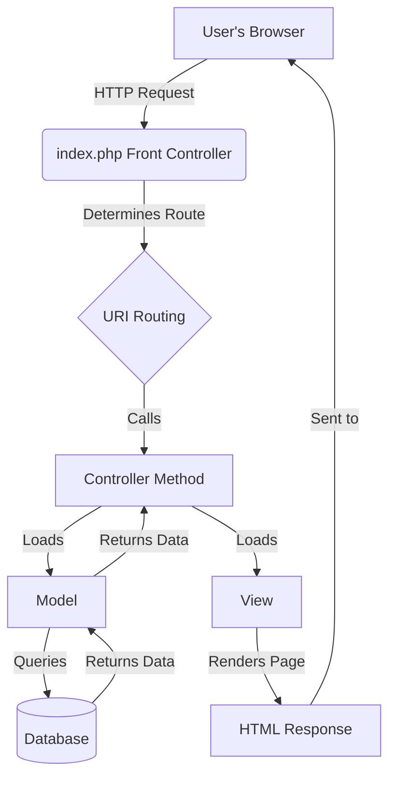

# E-Procurement Web Application

This is a comprehensive web-based e-procurement application built with the CodeIgniter 3 framework. It appears to be designed for managing the entire procurement lifecycle, from planning and vendor management to procurement execution and history tracking. The application was likely developed for an Indonesian enterprise (potentially Pertamina, based on configuration files).

## Features

- **User Authentication**: Secure login system for authorized personnel.
- **Dashboard**: A central dashboard for a high-level overview of procurement activities.
- **Master Data Management**: Modules for managing core data like Users and Currency Exchange Rates (`Kurs`).
- **Planning (`Perencanaan`)**: Tools for procurement planning and recapitulation.
- **Procurement Packaging (`Pemaketan`)**: Functionality to group items into procurement packages.
- **Procurement Execution (`Pengadaan`)**: Managing the active procurement process.
- **History (`Riwayat`)**: A complete history or audit trail of all procurement activities.
- **Data Export**: Ability to export data, likely into Excel format using the included PHPExcel library.
- **Calendar View**: A timeline/calendar view for tracking procurement schedules.

## Application Flow

This diagram illustrates the basic request-response flow in the CodeIgniter application.



## Technical Stack

- **Backend**: PHP / CodeIgniter 3.0.6
- **Frontend**: HTML, CSS, JavaScript, jQuery
- **Database**: MySQL or MariaDB
- **Key Libraries**:
  - [PHPExcel](https://github.com/PHPOffice/PHPExcel) (for reading/writing spreadsheet files)
  - [DOMPDF](https://github.com/dompdf/dompdf) (for PDF generation)
  - [jQuery](https://jquery.com/) and various plugins (DataTables, Highcharts, FullCalendar, etc.)

## Prerequisites

Before you begin, ensure you have the following installed/configured:
- A web server (Apache, Nginx, or IIS)
- **PHP 5.6** (use the distribution located at **`C:\tools\php56`** on Windows)
- **MySQL 5.7.44** database server (this project assumes a Docker-hosted instance on `localhost:3307` with username **`root`** and password **`Nusantara1234`**)
- `mod_rewrite` (or the **URL Rewrite** module on IIS) enabled on your web server

## Installation and Setup

1.  **Clone the repository:**
    ```bash
    git clone <your-repository-url>
    cd <repository-directory>
    ```

2.  **Configure Application URL:**
    - Open the file `application/config/config.php`.
    - Find the `$config['base_url']` variable and set it to the root URL of your project. Remember to include the trailing slash.
    ```php
    // Example for a local setup
    $config['base_url'] = 'http://localhost/main/';
    ```

3.  **Configure Database:**
    - Open the file `application/config/database.php`.
    - Modify the `'default'` database group with your database server details (hostname, username, password, database name).
    ```php
    // Example configuration for the provided Docker MySQL setup
    $db['default'] = array(
        'dsn'      => '',
        'hostname' => '127.0.0.1',  // Docker host
        'port'     => '3307',       // Mapped port
        'username' => 'root',
        'password' => 'Nusantara1234',
        'database' => 'eproc_perencanaan',
        'dbdriver' => 'mysqli',
        // ... other settings remain unchanged
    );
    ```

4.  **Import Database Schema:**
    - **Note:** A database dump (`.sql` file) is not included in this repository. You will need to obtain it separately and import it into the database you configured in the previous step.
    - The application may require multiple databases (e.g., `eproc_perencanaan` and `eproc`). Review the models and database configuration for full requirements.

5.  **Web Server Configuration:**
    - Ensure your web server's document root is pointing to the project's root directory (where the main `index.php` is located).
    - Make sure URL rewriting is enabled to handle CodeIgniter's clean URLs (by removing `index.php` from the path). An example `.htaccess` for Apache is provided below.

    **Example `.htaccess` for Apache:**
    ```apacheconf
    RewriteEngine On
    RewriteCond %{REQUEST_FILENAME} !-f
    RewriteCond %{REQUEST_FILENAME} !-d
    RewriteRule ^(.*)$ index.php/$1 [L]
    ```

    **Example `web.config` for IIS 10:**
    
    For IIS, ensure the **URL Rewrite** module is installed. Then, you can use the following `web.config` file in the project root to enable clean URLs.
    
    ```xml
    <?xml version="1.0" encoding="UTF-8"?>
    <configuration>
        <system.webServer>
            <rewrite>
                <rules>
                    <rule name="Index">
                        <match url="^(.*)$" />
                        <conditions>
                            <add input="{REQUEST_FILENAME}" matchType="IsFile" negate="true" />
                            <add input="{REQUEST_FILENAME}" matchType="IsDirectory" negate="true" />
                        </conditions>
                        <action type="Rewrite" url="index.php/{R:1}" />
                    </rule>
                </rules>
            </rewrite>
        </system.webServer>
    </configuration>
    ```

6.  **Run the Application:**
    - Open your web browser and navigate to the `base_url` you configured. You should see the application's login page.

## Directory Structure

- `application/`: Contains the core application logic (controllers, models, views, etc.).
- `assets/`: Publicly accessible frontend assets like CSS, JavaScript, images, and fonts.
- `system/`: The core CodeIgniter framework files.
- `vendor/`: Composer dependencies (though this project uses it minimally).
- `index.php`: The main front-controller for the application.

---
*This README was auto-generated based on project analysis.* 